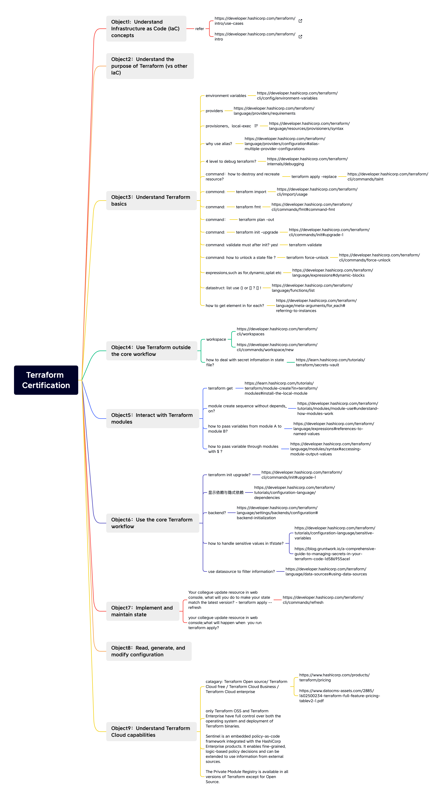

# 1 学习资料 

考试报名 
https://www.hashicorp.com/certification/terraform-associate
https://developer.hashicorp.com/certifications/infrastructure-automation

考试注册
[HashiCorp Cloud Engineer Certification Exam Portal](https://cp.certmetrics.com/hashicorp/en/login).

 Exam-taker Handbook 
 - https://hashicorp-certifications.zendesk.com/hc/en-us/articles/360048211571-Exam-taker-Handbook

官网
- https://developer.hashicorp.com/terraform/tutorials/certification-003/associate-study-003

帖子
- https://zhuanlan.zhihu.com/p/342735423
- https://easterfan.github.io/2023/07/10/%E5%87%BA%E4%BA%8E%E8%BF%B7%E8%8C%AB,-%E6%88%91%E5%8E%BB%E8%80%83%E4%BA%86Terraform-Associate.html
- https://zhuanlan.zhihu.com/p/342735423

Mock Exam
- Udemy 上面有 , 300  题 https://www.terraform-best-practices.com/
- https://medium.com/bb-tutorials-and-thoughts/250-practice-questions-for-terraform-associate-certification-7a3ccebe6a1a

# 2 细则

- 考试类型为单选、多选，58道考试题
- 只有一次考试机会，满分💯，70分通过
- 考试时间1小时，相对充足，我个人是35分钟左右答完，并估分是75
- 考试语言为英文，且只有这一种考试语言，所以考试前期最好背一背官方文档的单词
- 考试费需要使用visa卡支付，不支持支付宝，价格为70.5刀，人民币500多
- 务必提前30分钟进入考试终端，监考官会检查桌面、摄像头，不要佩戴任何首饰，尤其是耳环、项链和手镯，因为如果你带了这些额外的东西，监考官会和你沟通取下来，比如我当时认不得手镯这个单词，监考官和我沟通了5 6分钟，一直到他说”bend“，我才理解他是在说手镯，比较耽误时间
- 不支持身份证报考，需要护照
- 不能开中国发票，报销需要另想办法，我没有办法，所以是自费
- 考试结束，2天后证书下来

测验的形式是58道选择题，1小时的测验时间。

# 3 Exam objectives

1. Understand infrastructure as code (IaC) concepts
2. Understand Terraform's purpose (vs other IaC)
3. Understand Terraform basics
4. Use the Terraform CLI (outside of core workflow)
5. Interact with Terraform modules
6. Navigate Terraform workflow
7. Implement and maintain state
8. Read, generate, and modify configuration
9. Understand Terraform Cloud and Enterprise capabilities

https://github.com/EasterFan/easterfan.github.io/blob/master/static/imgs/terraform/Terraform%20Certification%20Conclusion.xmind

|1|Understand infrastructure as code (IaC) concepts|
|--:|:--|
|1a|Explain what IaC is|
|1b|Describe advantages of IaC patterns|

|2|Understand the purpose of Terraform (vs other IaC)|
|--:|:--|
|2a|Explain multi-cloud and provider-agnostic benefits|
|2b|Explain the benefits of state|

|3|Understand Terraform basics|
|--:|:--|
|3a|Install and version Terraform providers|
|3b|Describe plugin-based architecture|
|3c|Write Terraform configuration using multiple providers|
|3d|Describe how Terraform finds and fetches providers|

|4|Use Terraform outside of core workflow|
|--:|:--|
|4a|Describe when to use `terraform import` to import existing infrastructure into your Terraform state|
|4b|Use `terraform state` to view Terraform state|
|4c|Describe when to enable verbose logging and what the outcome/value is|

|5|Interact with Terraform modules|
|--:|:--|
|5a|Contrast and use different module source options including the public Terraform Module Registry|
|5b|Interact with module inputs and outputs|
|5c|Describe variable scope within modules/child modules|
|5d|Set module version|

|6|Use the core Terraform workflow|
|--:|:--|
|6a|Describe Terraform workflow ( Write -> Plan -> Create )|
|6b|Initialize a Terraform working directory (`terraform init`)|
|6c|Validate a Terraform configuration (`terraform validate`)|
|6d|Generate and review an execution plan for Terraform (`terraform plan`)|
|6e|Execute changes to infrastructure with Terraform (`terraform apply`)|
|6f|Destroy Terraform managed infrastructure (`terraform destroy`)|
|6g|Apply formatting and style adjustments to a configuration (`terraform fmt`)|

|7|Implement and maintain state|
|--:|:--|
|7a|Describe default `local` backend|
|7b|Describe state locking|
|7c|Handle backend and cloud integration authentication methods|
|7d|Differentiate remote state back end options|
|7e|Manage resource drift and Terraform state|
|7f|Describe `backend` block and cloud integration in configuration|
|7g|Understand secret management in state files|

|8|Read, generate, and modify configuration|
|--:|:--|
|8a|Demonstrate use of variables and outputs|
|8b|Describe secure secret injection best practice|
|8c|Understand the use of collection and structural types|
|8d|Create and differentiate `resource` and `data` configuration|
|8e|Use resource addressing and resource parameters to connect resources together|
|8f|Use HCL and Terraform functions to write configuration|
|8g|Describe built-in dependency management (order of execution based)|

|9|Understand Terraform Cloud capabilities|
|--:|:--|
|9a|Explain how Terraform Cloud helps to manage infrastructure|
|9b|Describe how Terraform Cloud enables collaboration and governance|

# 4 Prepare for Terraform Certification

https://developer.hashicorp.com/terraform/tutorials/certification-003?ajs_aid=c4d98913-1b0e-4059-a8a7-4058e53e7e23&product_intent=terraform

https://developer.hashicorp.com/terraform/tutorials/certification-003/associate-study-003

