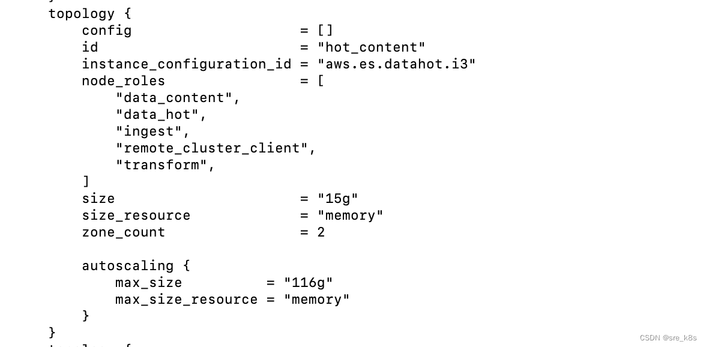
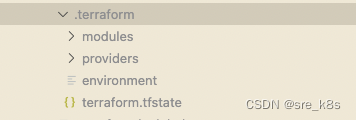
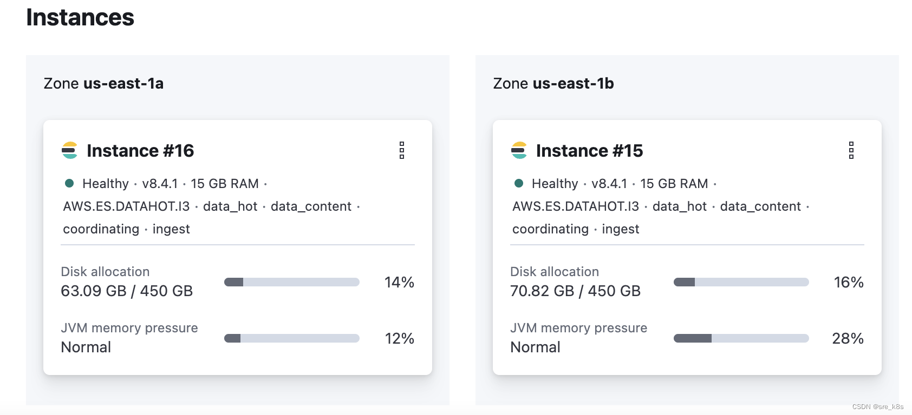
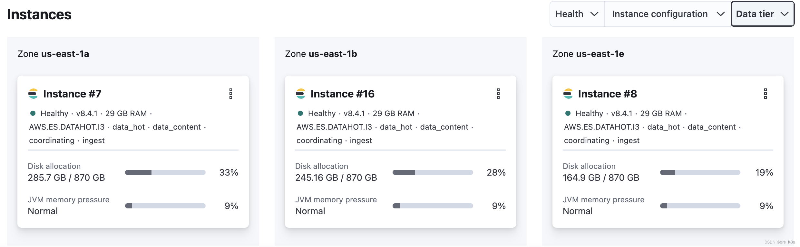

https://developer.hashicorp.com/terraform/language/state/workspaces
# 1 总览 

Each Terraform configuration has an associated backend that defines how Terraform executes operations and where Terraform stores persistent data, like state.

The persistent data stored in the backend belongs to a workspace. The backend initially has only one workspace containing one Terraform state associated with that configuration. Some backends support multiple named workspaces, allowing multiple states to be associated with a single configuration. ==The configuration still has only one backend, but you can deploy multiple distinct instances of that configuration without configuring a new backend or changing authentication credentials.==

Terraform工作空间（workspace）是一种用于管理多个环境的机制。它允许用户在同一个Terraform配置文件的基础上，创建多个环境，并使用不同的变量值和资源配置。

# 2 the difference between terraform CLI workspace and cloud workspace


Terraform开源版的Workspace与Terraform Cloud云服务的Workspace 实际上是不同的概念

- Terraform开源版的Workspace
- Terraform Cloud云服务的Workspace 
- Terraform Enterprise Workspace 

While Terraform Cloud workspaces facilitate executing runs, storing, and versioning state files in a shared, cloud-based environment, CLI workspaces offer a simpler approach for managing different states of infrastructure in less complex scenarios


# 3 Operation 

创建工作空间
使用terraform workspace new命令创建一个新的工作空间。例如，创建一个名为dev的工作空间：terraform workspace new dev


切换工作空间
使用terraform workspace select命令切换到另一个工作空间。例如，切换到名为prod的工作空间： terraform workspace select prod  如果该工作空间不存在，Terraform会自动创建一个新的工作空间。

配置变量
在每个工作空间中，可以使用不同的变量值来配置资源。可以在terraform.tfvars文件中为每个工作空间设置不同的变量值，也可以在命令行中使用-var参数设置变量值。


部署资源
使用terraform apply命令部署资源。Terraform会根据当前选择的工作空间，使用相应的变量值和资源配置来创建或更新基础设施。


# 4 例子 

https://blog.csdn.net/dongshi_89757/article/details/127904243
## 4.1 方案

当Terraform部署资源时，它将元数据存储在状态文件中以跟踪资源。因此，如果我们希望为多个环境(如DEV/QA/PROD)部署资源，我们还需要区分部署操作和状态文件。然而，通过terrform工作区Workspace和Reusable Modules （可重用模块）体系结构，我们可以实现单独的环境供应。

    Terraform Workspace——Terraform Workspace允许我们从单个配置文件源为所提供的后端中每个工作区管理单独的状态文件
    Reusable Modules ——在这种体系结构中，配置文件存储在单个目录中。通过共有模块，我们可以查找到对应目录并传递变量。

## 4.2 案例

公司使用Terraform在多个环境（INT,Staging, Prod）上部署Elastic Cloud，用作系统及客户日志存储分析等 。结合 Terraform Workspace 我们可以实现在不同环境中使用同个Terraform Module 来动态部署资源。例如，在INT环境中部署的 ES 节点使用更小的内存，分布在较少的Zone（以节省开支）， 而在Prod环境中需要启用更多的节点，来提高ES性能以及大量数据存储。

结论

我们看到了Workspace和reusable modules(可重用模块)如何帮助我们使用独立的状态文件管理独立的基础设施。Reusable modules可重用模块在env下各自的目录架构中运行，包含各个模块bolck、变量、提供程序和后端配置等。其中工作区工作在单个配置文件源上，并在后端创建工作区特定的状态文件。


## 4.3 具体实现

整体目录结构

-- terraform
|   |-- envs
|   |   |-- us-production
    |   |-- staging
    |   |-- qa
    |   |-- dev
|   |-- modules
|   |   |-- ec_deployment
    |   |-- ec_backup
    |   |-- ec_index_magement


首先，来看下 Reusable Modules (可重用模块), 放置在terraform/modules目录下
ec_deployment module 实现了整个ElastcCloud 部署代码

 modules
    |-- ec_deployment
    |   |-- README.md
    |   |-- data.tf
    |   |-- locals.tf
    |   |-- main.tf
    |   |-- outputs.tf
    |   |-- provider.tf
    |   |-- variables.tf


其中main.tf 为主代码实现elasticsearch主体结构，语法具体参考官网
```

resource "ec_deployment" "main" {
  name                   = var.deployment_name
  region                 = var.deployment_region
  version                = var.deployment_stack_version
  deployment_template_id = var.deployment_template_id
  alias                  = var.deployment_alias != "" ? var.deployment_alias : ""

  tags = var.tags

  elasticsearch {
    autoscale = "false"

    config {
      plugins            = var.elasticsearch_plugins
    }


    topology {
      id            = "hot_content"
      zone_count    = var.elasticsearch_hot_zones
      size          = var.elasticsearch_hot_size
      size_resource = "memory"
    }

  }

  kibana {
    topology {
      zone_count    = var.kibana_zones
      size          = var.kibana_size
      size_resource = "memory"
    }
  }
```


variables.tf 放置main.tf所引用的变量

```

variable "deployment_name" {
  type        = string
  description = "Identify deployment within ElasticCloud managed service"
}

variable "deployment_region" {
  type        = string
  description = "Select one of the available regions, https://www.elastic.co/guide/en/cloud/current/ec-reference-regions.html"
}


```

接着，在envs 目录中 定制各个ElasticCloud Terraform Code具体变量值

|   |-- envs
|   |   |-- us-production
|   |   |   |-- ec_deployment
|   |   |   |       |-- locals.tf
|   |   |   |       |-- main.tf
|   |   |   |       |-- outputs.tf
|   |   |   |       `-- provider.tf
|   |   |-- staging
|   |   |   |-- ec_deployment
|   |   |   |       |-- locals.tf
|   |   |   |       |-- main.tf
|   |   |   |       |-- outputs.tf
|   |   |   |       `-- provider.tf
|   |   |-- int
|   |   |   |-- ec_deployment
|   |   |   |       |-- locals.tf
|   |   |   |       |-- main.tf
|   |   |   |       |-- outputs.tf
|   |   |   |       `-- provider.tf


如INT下 main.tf
```
module "ec_deployment" {
  source = "../../../../modules/ec_deployment/"

  deployment_name          = "aws-integration-infra"
  deployment_region        = "us-east-1"
  deployment_stack_version = "8.4.1"
  deployment_template_id   = "aws-storage-optimized-v3"

  elasticsearch_hot_size     = "15g"
  elasticsearch_hot_zones    = 2
  elasticsearch_warm_size    = "4g"
  elasticsearch_warm_zones   = 0


```


PROD下 main.tf
```
module "ec_deployment" {
  source = "../../../../modules/ec_deployment/"

  deployment_name          = "aws-production-us-infra"
  deployment_region        = "us-east-1"
  deployment_stack_version = "8.4.1"
  deployment_template_id   = "aws-storage-optimized-v3"

  elasticsearch_hot_size     = "15g"
  elasticsearch_hot_zones    = 4
  elasticsearch_warm_size    = "4g"
  elasticsearch_warm_zones   = 2

```

可以看到 INT和PROD的main.tf 中 使用source引用同个ec_deployment模块,并配置相应的环境变量参数


最后，重要的事，我们将不同Terraform Workspace的定义放在各自env下 provider.tf 中
如INT下provider.tf

```

terraform {
  required_version = "~> 1.3.2"

  required_providers {
    ec = {
      source  = "elastic/ec"
      version = "~> 0.4.0"
    }
    aws = {
      source  = "hashicorp/aws"
      version = "~> 4.5"
    }
  }

  cloud {
    organization = "terraform-cloud"

    workspaces {
      name = "infra-elasticsearch--ec_deployment--aws--integration--infra"
    }
  }
}

```


这样，该目录下只为该工作区完成ElasticCloud的部署

例如，我们在envs/integration/ec_deployment/目录下 执行terraform plan


Terraform Plan 之后， 该目录下会生产terraform.tfstate 文件，用以保存当前工作区下已部署的资源状态


## 4.4 结论

我们看到了Workspace和reusable modules(可重用模块)如何帮助我们使用独立的状态文件管理独立的基础设施。Reusable modules可重用模块在env下各自的目录架构中运行，包含各个模块bolck、变量、提供程序和后端配置等。其中工作区工作在单个配置文件源上，并在后端创建工作区特定的状态文件。





Prod 环境下的 ES hot 节点状态：



