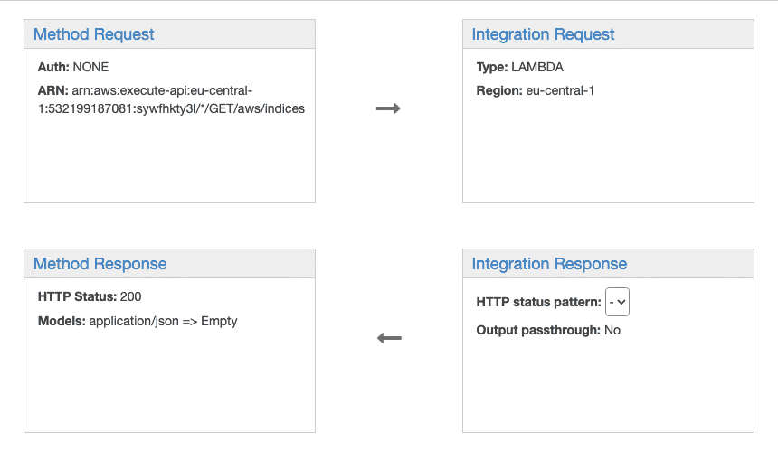
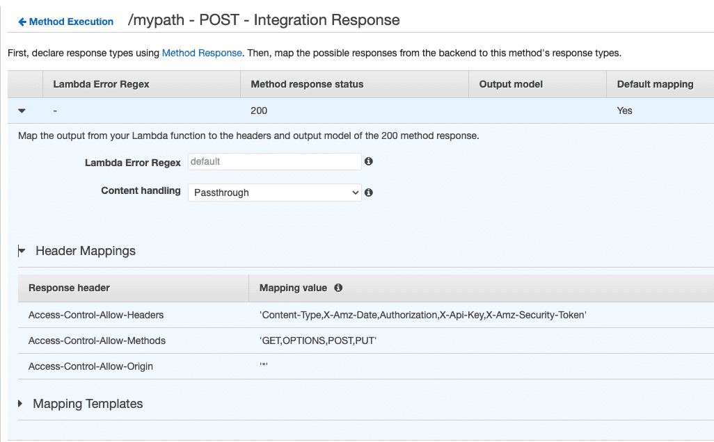
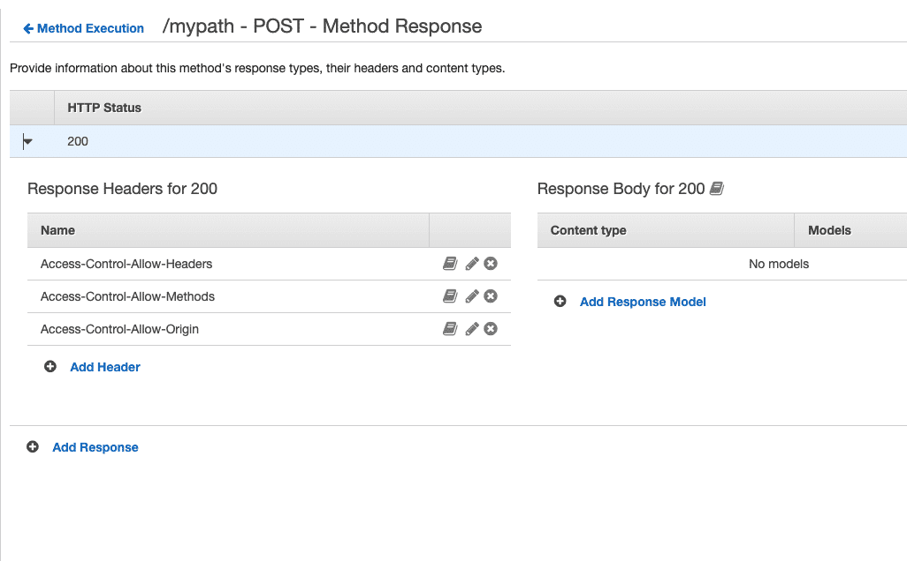

mad-api-helpers-aws/ filter 

How to Create API Gateway Using Terraform & AWS Lambda: https://spacelift.io/blog/terraform-api-gateway#step-11-set-up-the-domain-name-for-the-api

# 1 datasource.tf 
```sh
#### ****************************************************************************************** ####
#### *                                     DATA SOURCES                                       * ####
#### ****************************************************************************************** ####

#### ________________________________________________________________ Common data sources _____ ####

# Current region.
data "aws_region" "current" {}

# Account alias of the current account.
data "aws_iam_account_alias" "current" {}

# Identity of the caller. Used to get account id.
data "aws_caller_identity" "current" {}

# IDs of all VPCs.
data "aws_vpcs" "all" {}

# All VPCs.
data "aws_vpc" "all" {
  count = length(data.aws_vpcs.all.ids)

  id    = tolist(data.aws_vpcs.all.ids)[count.index]
}


#### __________________________________________________________________ Subnet collection _____ ####

# IDs of subnets belonging to target VPC
data "aws_subnets" "target_vpc" {
  filter {
    name   = "vpc-id"
    values = [local.target_vpc.id]
  }
}

# Subnet objects belonging to target VPC
data "aws_subnet" "target_vpc" {
  for_each = toset(data.aws_subnets.target_vpc.ids)

  id       = each.value
}

# Security groups information, including IDs, for target VPC
data "aws_security_groups" "target_vpc" {
  filter {
    name   = "vpc-id"
    values = [local.target_vpc.id]
  }
}

# Security groups belonging to target VPC
data "aws_security_group" "target_vpc" {
  for_each = toset(data.aws_security_groups.target_vpc.ids)

  id       = each.value
}

```


## 1.1 解析

```sh
# IDs of all VPCs.
data "aws_vpcs" "all" {}

# All VPCs.
data "aws_vpc" "all" {
  count = length(data.aws_vpcs.all.ids)

  id    = tolist(data.aws_vpcs.all.ids)[count.index]
}
```


1 
In Terraform, count.index is a built-in variable that represents the current iteration index when using the count parameter in a resource or data block. 
```
data "aws_vpc" "all" {
  count = 3
  id    = ["vpc-aaa111", "vpc-bbb222", "vpc-ccc333"][count.index]
}

{
  id         = "vpc-aaa111"
  cidr_block = "10.0.0.0/16"
  tags       = { Name = "dev-vpc" }
}
```


count.index  是如何运作的 
How It Works: 1️⃣ count = 3 → Terraform creates 3 instances of data "aws_vpc" "all".
2️⃣ The id is dynamically assigned based on the index in the list:
```
    count.index = 0 → id = "vpc-aaa111"

    count.index = 1 → id = "vpc-bbb222"

    count.index = 2 → id = "vpc-ccc333"
```


2 


# 2 iam.tf
```sh
#### ****************************************************************************************** ####
#### *                                      RESOURCES                                         * ####
#### ****************************************************************************************** ####


#### ______ lambda instance profile _____ ####

# IAM policies
# The local variable lambda_cache_policies is defined at the end of this file.
resource "aws_iam_policy" "iam_filter_cc_policies" {
  # local variable defined at end of this file
  for_each = local.lambda_filter_cc_policies

  name        = "${each.key}.policy"
  description = each.value.description
  path        = "/"
  policy      = each.value.policy
}

resource "aws_iam_policy" "iam_filter_version_policies" {
  # local variable defined at end of this file
  for_each = local.lambda_filter_version_policies

  name        = "${each.key}.policy"
  description = each.value.description
  path        = "/"
  policy      = each.value.policy
}

# IAM role filter_cc lambda function
resource "aws_iam_role" "lambda_filter_cc_role" {
  name               = "${var.ressource_prefix}_filter_cc.role"
  description        = "The IAM role for the lambda function that computes the s3 tag filter. "
  tags               = merge(var.common_tags, { Name = "${var.ressource_prefix}_filter_cc.role" })
  # local variable defined at end of this file
  assume_role_policy = local.lambda_assume_role_policy
}
# IAM role filter_version lambda function
resource "aws_iam_role" "lambda_filter_version_role" {
  name               = "${var.ressource_prefix}_filter_version.role"
  description        = "The IAM role for the lambda function that computes the s3 tag filter. "
  tags               = merge(var.common_tags, { Name = "${var.ressource_prefix}_filter_version.role" })
  # local variable defined at end of this file
  assume_role_policy = local.lambda_assume_role_policy
}

# IAM policy attachments for filter_cc lambda function
resource "aws_iam_role_policy_attachment" "iam_filter_cc" {
  for_each = aws_iam_policy.iam_filter_cc_policies

  role       = aws_iam_role.lambda_filter_cc_role.name
  policy_arn = each.value.arn
}

# IAM policy attachments for filter_version lambda function
resource "aws_iam_role_policy_attachment" "iam_filter_version" {
  for_each = aws_iam_policy.iam_filter_version_policies

  role       = aws_iam_role.lambda_filter_version_role.name
  policy_arn = each.value.arn
}


#### _________ Local variables used in this file only _____ ####

[Effect]  [principal]  [Action]  [Resources ]
allow  xx principal do actions on xx resources 

locals {

  lambda_assume_role_policy = <<-EOF
  {
    "Version": "2012-10-17",
    "Statement": [
      {
        "Effect": "Allow",
        "Principal": {
          "Service": "lambda.amazonaws.com"
        },
        "Action": "sts:AssumeRole"
      }
    ]
  }
  EOF

  #### ____ policies for lambda filter function  _____ ####

  lambda_filter_cc_policies = {
      "${var.ressource_prefix}_filter_cc_cloudwatch_push" = {
      description = "Grants log create permissions to lambda function."
      policy      = <<-EOF
      {
        "Version": "2012-10-17",
        "Statement": [
          {
            "Effect": "Allow",
            "Action": [
              "logs:CreateLogStream",
              "logs:PutLogEvents"
            ],
            "Resource": [
              "arn:aws:logs:${local.region}:${local.account_id}:log-group:/aws/lambda/${var.ressource_prefix}_filter_cc:*"
            ]
          }
        ]
      }
      EOF
    }

    "${var.ressource_prefix}_filter_cc_dynamo_ro" = {
      description = "Grants lambda function read only access to dynamo table."
      policy      = <<-EOF
      {
        "Version": "2012-10-17",
        "Statement": [
          {
            "Action": [
              "dynamodb:GetItem",
              "dynamodb:Scan"
            ],
            "Effect": "Allow",
            "Resource": [
              "arn:aws:dynamodb:${local.region}:${local.account_id}:table/${var.cache_table}"
            ]
          }
        ]
      }
      EOF
    }
  }

  lambda_filter_version_policies = {
      "${var.ressource_prefix}_filter_version_cloudwatch_push" = {
      description = "Grants log create permissions to lambda function."
      policy      = <<-EOF
      {
        "Version": "2012-10-17",
        "Statement": [
          {
            "Effect": "Allow",
            "Action": [
              "logs:CreateLogStream",
              "logs:PutLogEvents"
            ],
            "Resource": [
              "arn:aws:logs:${local.region}:${local.account_id}:log-group:/aws/lambda/${var.ressource_prefix}_filter_version:*"
            ]
          }
        ]
      }
      EOF
    }

    "${var.ressource_prefix}_filter_version_dynamo_ro" = {
      description = "Grants lambda function read only access to dynamo table."
      policy      = <<-EOF
      {
        "Version": "2012-10-17",
        "Statement": [
          {
            "Action": [
              "dynamodb:GetItem"
            ],
            "Effect": "Allow",
            "Resource": [
              "arn:aws:dynamodb:${local.region}:${local.account_id}:table/${var.cache_table}"
            ]
          }
        ]
      }
      EOF
    }

    "${var.ressource_prefix}_filter_version_s3_ro" = {
      description = "Grants read only access to src_bucket. "
      policy      = <<-EOF
      {
        "Version": "2012-10-17",
        "Statement": [
          {
            "Effect": "Allow",
            "Action": [
              "s3:List*",
              "s3:GetObjectTagging"
            ],
            "Resource": [
              "arn:aws:s3:::${var.ivuplan_release_bucket}",
              "arn:aws:s3:::${var.ivuplan_release_bucket}/*"
            ]
          }
        ]
      }
      EOF
    }
  }
}

```

---


```
resource "aws_iam_role" "lambda_role" {

  name = "lambda-role"


  assume_role_policy = jsonencode({

    Version = "2012-10-17",

    Statement = [

    {

      Action = "sts:AssumeRole",

      Effect = "Allow",

      Principal = {

        Service = "lambda.amazonaws.com"

      }

    }

  ]

})

}


resource "aws_iam_role_policy_attachment" "lambda_basic" {
// 这个 AWSLambdaBasicExecutionRole 将会赋给 lambda function 
  policy_arn = "arn:aws:iam::aws:policy/service-role/AWSLambdaBasicExecutionRole"  

  role = aws_iam_role.lambda_role.name

}
```


# 3 locals.tf 
```sh
#### ****************************************************************************************** ####
#### *                                COMMON LOCAL VARIABLES                                  * ####
#### ****************************************************************************************** ####


#### _____________________________________________________________ Account data variables _____ ####

locals {

  # The account ID of the current account.
  account_id   = data.aws_caller_identity.current.account_id

  # The account name or alias of the current account
  account_name = data.aws_iam_account_alias.current.account_alias

  # The name of the current region.
  region = data.aws_region.current.name

  # All VPCs, mapped to their Name tag as key. VPCs without Name tag are not included.
  vpcs_by_name = {
    for vpc in data.aws_vpc.all :
    lookup(vpc.tags, "Name") => vpc
    if contains(keys(vpc.tags), "Name")
  }

  # All VPCs, mapped to their ID as key.
  vpcs_by_id = {
    for vpc in data.aws_vpc.all :
    vpc.id => vpc
  }

  # The target VPC where hosts and volumes should be created.
  target_vpc = lookup(local.vpcs_by_name, var.vpc, lookup(local.vpcs_by_id, var.vpc, null))

  # Security groups of the configured VPC (global.vpc), mapped to their Name tag as key. Security
  # groups without Name tag are not included.
  vpc_security_groups_by_name = {
    for security_group in data.aws_security_group.target_vpc :
    lookup(security_group.tags, "Name") => security_group
    if contains(keys(security_group.tags), "Name")
  }

  vpc_security_groups_by_id = {
    for sg in data.aws_security_group.target_vpc :
    sg.id => sg
  }

  target_security_group = lookup(local.vpc_security_groups_by_name, var.security_group, lookup(local.vpc_security_groups_by_id, var.security_group, null))

  lambda_filter_cc_archive_location = "outputs/lambda_filter.zip"
  lambda_filter_version_archive_location = "outputs/lambda_version.zip"
  lambda_get_tag_value_archive_location = "outputs/lambda_get_tag.zip"
}

```


## 3.1 解析


1
All VPCs, mapped to their Name tag as key. VPCs without Name tag are not included.
```
  vpcs_by_name = {
    for vpc in data.aws_vpc.all :
    lookup(vpc.tags, "Name") => vpc
    if contains(keys(vpc.tags), "Name")
  }
```


if contains(keys(vpc.tags), "Name") ensures that only VPCs with a "Name" tag are included.

返回值 类似于 
```
{
  "dev-vpc"  = { id = "vpc-aaa111", tags = { Name = "dev-vpc", Owner = "team-a" } }
  "prod-vpc" = { id = "vpc-ccc333", tags = { Name = "prod-vpc", Environment = "prod" } }
}
```


2 
```
 # All VPCs, mapped to their ID as key.
  vpcs_by_id = {
    for vpc in data.aws_vpc.all :
    vpc.id => vpc
  }
```


3
 var.vpc 有可能给入的是 vpc id, 或者 vpc name ,  

```
 # The target VPC where hosts and volumes should be created.
  target_vpc = lookup(local.vpcs_by_name, var.vpc, lookup(local.vpcs_by_id, var.vpc, null))
```


# 4 main.tf
```sh
data "archive_file" "lambda_filter_cc_archive" {
  type = "zip"
  source_file = "${path.module}/files/filter_tags.py"
  output_path = local.lambda_filter_cc_archive_location
}

data "archive_file" "lambda_filter_version_archive" {
  type = "zip"
  source_file = "${path.module}/files/filter_versions.py"
  output_path = local.lambda_filter_version_archive_location
}

data "archive_file" "lambda_get_tag_value_archive" {
  type = "zip"
  source_file = "${path.module}/files/get_tag_value.py"
  output_path = local.lambda_get_tag_value_archive_location
}

resource "aws_lambda_function" "lambda_filter_cc_function" {
  filename = local.lambda_filter_cc_archive_location
  source_code_hash = data.archive_file.lambda_filter_cc_archive.output_base64sha256
  function_name = "${var.ressource_prefix}_filter_cc"
  role = aws_iam_role.lambda_filter_cc_role.arn
  handler = "filter_tags.lambda_handler"
  runtime = "python3.8"
  environment {
    variables = {
      cache_table = var.cache_table
    }
  }
}

resource "aws_lambda_function" "lambda_filter_version_function" {
  filename = local.lambda_filter_version_archive_location
  source_code_hash = data.archive_file.lambda_filter_version_archive.output_base64sha256
  function_name = "${var.ressource_prefix}_filter_version"
  role = aws_iam_role.lambda_filter_version_role.arn
  handler = "filter_versions.lambda_handler"
  runtime = "python3.8"
  timeout = 15
  environment {
    variables = {
      cache_table = var.cache_table
      bucket = var.ivuplan_release_bucket
    }
  }
}

resource "aws_lambda_function" "lambda_get_tag_value_function" {
  filename = local.lambda_get_tag_value_archive_location
  source_code_hash = data.archive_file.lambda_get_tag_value_archive.output_base64sha256
  function_name = "${var.ressource_prefix}_get_tag_value"
  role = aws_iam_role.lambda_filter_cc_role.arn
  handler = "get_tag_value.lambda_handler"
  runtime = "python3.8"
  environment {
    variables = {
      cache_table = var.cache_table
    }
  }
}

resource "aws_cloudwatch_log_group" "lambda_filter_cc_log_group" {
  name = "/aws/lambda/${aws_lambda_function.lambda_filter_cc_function.function_name}"
  retention_in_days = 90
  kms_key_id = var.cloudwatch-kms-arn
}

resource "aws_cloudwatch_log_group" "lambda_filter_version_log_group" {
  name = "/aws/lambda/${aws_lambda_function.lambda_filter_version_function.function_name}"
  retention_in_days = 90
  kms_key_id = var.cloudwatch-kms-arn
}

resource "aws_cloudwatch_log_group" "lambda_get_tag_value_log_group" {
  name = "/aws/lambda/${aws_lambda_function.lambda_get_tag_value_function.function_name}"
  retention_in_days = 90
  kms_key_id = var.cloudwatch-kms-arn
}

resource "aws_vpc_endpoint" "vpce_apigw" {
  vpc_id            = local.target_vpc.id
  service_name      = "com.amazonaws.${local.region}.execute-api"
  vpc_endpoint_type = "Interface"
  subnet_ids        = [tolist(toset(data.aws_subnets.target_vpc.ids))[0]]
  private_dns_enabled = false
  security_group_ids = [
    local.target_security_group.id,
  ]
}

resource "aws_api_gateway_rest_api" "lambda_rest_api" {
  name = var.api_name
  endpoint_configuration {
    types = ["PRIVATE"]
    vpc_endpoint_ids = [aws_vpc_endpoint.vpce_apigw.id]
  }
}

resource "aws_api_gateway_rest_api_policy" "lambda_rest_api_policy" {
  rest_api_id = aws_api_gateway_rest_api.lambda_rest_api.id

  policy = <<EOF

{
  "Version": "2012-10-17",
  "Statement": [
    {
      "Effect": "Allow",
      "Principal": "*",
      "Action": "execute-api:Invoke",
      "Resource": "${aws_api_gateway_rest_api.lambda_rest_api.execution_arn}/*/*/*"
    }
  ]
}
EOF
}

resource "aws_api_gateway_resource" "lambda_filter_cc_rest_ressource" {
  parent_id   = aws_api_gateway_rest_api.lambda_rest_api.root_resource_id
  path_part   = var.api_filter_cc_path
  rest_api_id = aws_api_gateway_rest_api.lambda_rest_api.id
}

resource "aws_api_gateway_resource" "lambda_filter_version_rest_ressource" {
  parent_id   = aws_api_gateway_rest_api.lambda_rest_api.root_resource_id
  path_part   = var.api_filter_version_path
  rest_api_id = aws_api_gateway_rest_api.lambda_rest_api.id
}

resource "aws_api_gateway_resource" "lambda_get_tag_value_rest_ressource" {
  parent_id   = aws_api_gateway_rest_api.lambda_rest_api.root_resource_id
  path_part   = var.api_get_tag_value_path
  rest_api_id = aws_api_gateway_rest_api.lambda_rest_api.id
}

resource "aws_api_gateway_method" "lambda_filter_cc_rest_method" {
  authorization = "NONE"
  http_method   = "GET"
  resource_id   = aws_api_gateway_resource.lambda_filter_cc_rest_ressource.id
  rest_api_id   = aws_api_gateway_rest_api.lambda_rest_api.id
}

resource "aws_api_gateway_method" "lambda_filter_version_rest_method" {
  authorization = "NONE"
  http_method   = "GET"
  resource_id   = aws_api_gateway_resource.lambda_filter_version_rest_ressource.id
  rest_api_id   = aws_api_gateway_rest_api.lambda_rest_api.id
}

resource "aws_api_gateway_method" "lambda_get_tag_value_rest_method" {
  authorization = "NONE"
  http_method   = "GET"
  resource_id   = aws_api_gateway_resource.lambda_get_tag_value_rest_ressource.id
  rest_api_id   = aws_api_gateway_rest_api.lambda_rest_api.id
}

# Lambda
resource "aws_lambda_permission" "apigw_lambda_filter_cc_invocation" {
  statement_id  = "AllowExecutionFromAPIGateway"
  action        = "lambda:InvokeFunction"
  function_name = aws_lambda_function.lambda_filter_cc_function.function_name
  principal     = "apigateway.amazonaws.com"

  # More: http://docs.aws.amazon.com/apigateway/latest/developerguide/api-gateway-control-access-using-iam-policies-to-invoke-api.html
  source_arn = "arn:aws:execute-api:${local.region}:${local.account_id}:${aws_api_gateway_rest_api.lambda_rest_api.id}/*/${aws_api_gateway_method.lambda_filter_cc_rest_method.http_method}${aws_api_gateway_resource.lambda_filter_cc_rest_ressource.path}"
}

resource "aws_lambda_permission" "apigw_lambda_filter_version_invocation" {
  statement_id  = "AllowExecutionFromAPIGateway"
  action        = "lambda:InvokeFunction"
  function_name = aws_lambda_function.lambda_filter_version_function.function_name
  principal     = "apigateway.amazonaws.com"

  # More: http://docs.aws.amazon.com/apigateway/latest/developerguide/api-gateway-control-access-using-iam-policies-to-invoke-api.html
  source_arn = "arn:aws:execute-api:${local.region}:${local.account_id}:${aws_api_gateway_rest_api.lambda_rest_api.id}/*/${aws_api_gateway_method.lambda_filter_version_rest_method.http_method}${aws_api_gateway_resource.lambda_filter_version_rest_ressource.path}"
}

resource "aws_lambda_permission" "apigw_lambda_get_tag_value_invocation" {
  statement_id  = "AllowExecutionFromAPIGateway"
  action        = "lambda:InvokeFunction"
  function_name = aws_lambda_function.lambda_get_tag_value_function.function_name
  principal     = "apigateway.amazonaws.com"

  # More: http://docs.aws.amazon.com/apigateway/latest/developerguide/api-gateway-control-access-using-iam-policies-to-invoke-api.html
  source_arn = "arn:aws:execute-api:${local.region}:${local.account_id}:${aws_api_gateway_rest_api.lambda_rest_api.id}/*/${aws_api_gateway_method.lambda_get_tag_value_rest_method.http_method}${aws_api_gateway_resource.lambda_get_tag_value_rest_ressource.path}"
}

resource "aws_api_gateway_integration" "lambda_filter_cc_integration" {
  rest_api_id             = aws_api_gateway_rest_api.lambda_rest_api.id
  resource_id             = aws_api_gateway_resource.lambda_filter_cc_rest_ressource.id
  http_method             = aws_api_gateway_method.lambda_filter_cc_rest_method.http_method
  integration_http_method = "POST"
  type                    = "AWS_PROXY"
  uri                     = aws_lambda_function.lambda_filter_cc_function.invoke_arn
}

resource "aws_api_gateway_integration" "lambda_filter_version_integration" {
  rest_api_id             = aws_api_gateway_rest_api.lambda_rest_api.id
  resource_id             = aws_api_gateway_resource.lambda_filter_version_rest_ressource.id
  http_method             = aws_api_gateway_method.lambda_filter_version_rest_method.http_method
  integration_http_method = "POST"
  type                    = "AWS_PROXY"
  uri                     = aws_lambda_function.lambda_filter_version_function.invoke_arn
}

resource "aws_api_gateway_integration" "lambda_get_tag_value_integration" {
  rest_api_id             = aws_api_gateway_rest_api.lambda_rest_api.id
  resource_id             = aws_api_gateway_resource.lambda_get_tag_value_rest_ressource.id
  http_method             = aws_api_gateway_method.lambda_get_tag_value_rest_method.http_method
  integration_http_method = "POST"
  type                    = "AWS_PROXY"
  uri                     = aws_lambda_function.lambda_get_tag_value_function.invoke_arn
}

resource "aws_api_gateway_deployment" "lambda_api_deployment" {
  rest_api_id = aws_api_gateway_rest_api.lambda_rest_api.id

  triggers = {
    # NOTE: The configuration below will satisfy ordering considerations,
    #       but not pick up all future REST API changes. More advanced patterns
    #       are possible, such as using the filesha1() function against the
    #       Terraform configuration file(s) or removing the .id references to
    #       calculate a hash against whole resources. Be aware that using whole
    #       resources will show a difference after the initial implementation.
    #       It will stabilize to only change when resources change afterwards.
    redeployment = sha1(jsonencode([
      aws_api_gateway_resource.lambda_filter_cc_rest_ressource,
      aws_api_gateway_resource.lambda_filter_version_rest_ressource,
      aws_api_gateway_resource.lambda_get_tag_value_rest_ressource,
      aws_api_gateway_method.lambda_filter_cc_rest_method,
      aws_api_gateway_method.lambda_filter_version_rest_method,
      aws_api_gateway_method.lambda_get_tag_value_rest_method,
      aws_api_gateway_integration.lambda_filter_cc_integration,
      aws_api_gateway_integration.lambda_filter_version_integration,
      aws_api_gateway_integration.lambda_get_tag_value_integration,
      aws_api_gateway_rest_api_policy.lambda_rest_api_policy
    ]))
  }

  lifecycle {
    create_before_destroy = true
  }
}

resource "aws_api_gateway_stage" "lambda_rest_stage" {
  deployment_id = aws_api_gateway_deployment.lambda_api_deployment.id
  rest_api_id   = aws_api_gateway_rest_api.lambda_rest_api.id
  stage_name    = var.api_stage_name
}

resource "aws_api_gateway_method_settings" "dev_settings" {
  rest_api_id = aws_api_gateway_rest_api.lambda_rest_api.id
  stage_name = aws_api_gateway_stage.lambda_rest_stage.stage_name
  method_path = "*/*"
  settings {
    logging_level = "INFO"
    metrics_enabled = true
  }
}

resource "aws_api_gateway_deployment" "lambda_api_logging_redeployment" {
  rest_api_id = aws_api_gateway_rest_api.lambda_rest_api.id

  triggers = {
    # NOTE: The configuration below will satisfy ordering considerations,
    #       but not pick up all future REST API changes. More advanced patterns
    #       are possible, such as using the filesha1() function against the
    #       Terraform configuration file(s) or removing the .id references to
    #       calculate a hash against whole resources. Be aware that using whole
    #       resources will show a difference after the initial implementation.
    #       It will stabilize to only change when resources change afterwards.
    redeployment = sha1(jsonencode([
      aws_api_gateway_method_settings.dev_settings
    ]))
  }

  lifecycle {
    create_before_destroy = true
  }
}

resource "aws_cloudwatch_log_group" "api_gw_filter_log_group" {
  name = "API-Gateway-Execution-Logs_${aws_api_gateway_rest_api.lambda_rest_api.id}/${aws_api_gateway_stage.lambda_rest_stage.stage_name}"
  retention_in_days = 90
  kms_key_id = var.cloudwatch-kms-arn
}

```


## 4.1 Lambda function

1
  用来将 py script 打包 

```
data "archive_file" "lambda_filter_cc_archive" {
  type = "zip"
  source_file = "${path.module}/files/filter_tags.py"
  output_path = local.lambda_filter_cc_archive_location
}
```


2
Terraform aws_lambda_function - handler Parameter

The handler parameter in the aws_lambda_function resource defines the entry point of your Lambda function. ==It specifies which function AWS Lambda should execute when triggered.==

在你的 AWS Lambda 资源 aws_lambda_function.lambda_filter_cc_function 中，cache_table 作为环境变量传递给 Lambda。你可以在 Lambda 代码中 访问和使用 这个变量，比如在 Python 代码中用于 DynamoDB 操作。

```
resource "aws_lambda_function" "lambda_filter_cc_function" {
  filename = local.lambda_filter_cc_archive_location
  source_code_hash = data.archive_file.lambda_filter_cc_archive.output_base64sha256
  function_name = "${var.ressource_prefix}_filter_cc"
  role = aws_iam_role.lambda_filter_cc_role.arn
  handler = "filter_tags.lambda_handler"
  runtime = "python3.8"
  environment {
    variables = {
      cache_table = var.cache_table
    }
  }
}
```


## 4.2 Lambda function 的 logging 

1 Link Lambda Function with CloudWatch Log Group automatically 
Once the IAM role is in place and the Lambda function is invoked, AWS Lambda will create a log stream under the corresponding CloudWatch Log Group, which by default is named /aws/lambda/`<lambda-function-name>.`


2 Link Lambda Function with CloudWatch Log Group  manually 
```
resource "aws_lambda_function" "my_lambda" {
  function_name = "my_lambda_function"
  runtime       = "nodejs14.x"
  handler       = "index.handler"

  role = aws_iam_role.lambda_execution_role.arn
  s3_bucket = "my-lambda-code-bucket"
  s3_key    = "lambda_code.zip"

  # Optional: specify the log group ARN (this is typically auto-created)
  environment {
    variables = {
      LOG_GROUP_ARN = aws_cloudwatch_log_group.lambda_log_group.arn
    }
  }
}

```

3
An AWS CloudWatch Log Group is a container for log streams, where AWS services (e.g., Lambda, ECS, EC2) store logs. Log groups help organize logs by function or application.

```
resource "aws_cloudwatch_log_group" "lambda_filter_cc_log_group" {
  name = "/aws/lambda/${aws_lambda_function.lambda_filter_cc_function.function_name}"
  retention_in_days = 90
  kms_key_id = var.cloudwatch-kms-arn
}

```


## 4.3 API Geteway 


### 4.3.1 API Gateway & VPC Endpoint Relationship


lambda , api gateway , s3 不在 vpc 里面
rundeck in ec2 instance 在 vpc 里面， 所以需要一个 vpc endpoint 


1. Create a Private API Gateway
    1. Set endpoint_configuration { types = ["PRIVATE"] } in Terraform.
    2. This API will not be publicly accessible.
2. Create a VPC Endpoint for API Gateway
    1. The VPC Endpoint connects the VPC to API Gateway using AWS PrivateLink.
    2. The endpoint provides a private IP for the API.
3. Attach the VPC Endpoint to API Gateway
    1. Add the VPC Endpoint ID (vpc_endpoint_ids) to the API Gateway configuration.
    2. Configure Route 53 private DNS (if needed) for custom domain resolution.


1 resource "aws_vpc_endpoint" "vpce_apigw" { } 

This creates a VPC Endpoint (VPCe) for API Gateway using an Interface endpoint.
A VPC Endpoint allows AWS services (like API Gateway) to be accessed privately within a VPC without needing an Internet Gateway (IGW), NAT Gateway, or VPN.

用于  vpc gateway 之中 的 aws service 相互的交流 

VPC endpoints are virtual devices that enable communication between instances in an Amazon VPC and various services. These endpoints enhance network traffic without compromising availability or restricting bandwidth.
With a VPC endpoint, you can establish a private connection to specific AWS services and VPC endpoint services through AWS PrivateLink. It eliminates the need for public IP addresses for communication between these services and your Amazon VPC instances. 
Interface Endpoint – a group of elastic network interfaces (ENI) created by the VPC in the subnet you specify. Each ENI is assigned a private IP address and serves as the primary entry point for traffic directed to a supported service. 


2 resource "aws_api_gateway_rest_api" "lambda_rest_api" 

Creates a REST API Gateway that is only accessible from the VPC.
Normally, API Gateway (REST API) is publicly accessible over the internet. However, you can create a Private API Gateway that is only accessible within a VPC by associating it with a VPC Endpoint.


`vpc_endpoint_ids = [aws_vpc_endpoint.vpce_apigw.id] → Links the API Gateway to the VPC Endpoint.`


3 resource "aws_api_gateway_rest_api_policy" "lambda_rest_api_policy"

This allows API access through the VPC Endpoint.

```
{
  "Version": "2012-10-17",
  "Statement": [
    {
      "Effect": "Allow",
      "Principal": "*",
      "Action": "execute-api:Invoke",
      "Resource": "${aws_api_gateway_rest_api.lambda_rest_api.execution_arn}/*/*/*"
    }
  ]
}
```

Your API Gateway policy currently allows any principal `(*) t`o invoke (execute-api:Invoke) any method `(*/*/*) `on your API. This means any entity (including external users) could access your API if it were public.
Allows any principal` ("*") `to invoke the API Gateway.
Resource grants access to all `methods (*), all stages (*), all paths (*).`


If your API Gateway is public, this policy exposes your API to everyone on the internet.
If your API is private, this policy still allows all resources inside your AWS account to invoke the API, which might be too broad.


----

### 4.3.2 aws_api_gateway_resource and aws_api_gateway_method


- User makes a request → GET [https://{api-id}.execute-api.{region}.amazonaws.com/{stage}/{api_filter_cc_path}](https://%7bapi-id%7d.execute-api.%7bregion%7d.amazonaws.com/%7bstage%7d/%7bapi_filter_cc_path%7d)
- API Gateway receives the request and forwards it to Lambda.
    - The method (GET) is matched in aws_api_gateway_method.lambda_filter_cc_rest_method.http_method.
    - API Gateway then invokes the Lambda function using POST (required).
- Lambda function processes the request and returns a JSON response.
- API Gateway forwards the response to the user.


4  API Gateway Resource (aws_api_gateway_resource.lambda_filter_cc_rest_ressource)
- Defines a new REST API resource under the root API endpoint.
- The resource path is set via var.api_filter_cc_path.


we are creating an API Gateway API and adding a root resource to the same
```
resource "aws_api_gateway_resource" "lambda_filter_cc_rest_ressource" {
  parent_id   = aws_api_gateway_rest_api.lambda_rest_api.root_resource_id
  path_part   = var.api_filter_cc_path
  rest_api_id = aws_api_gateway_rest_api.lambda_rest_api.id
}

```


5 API Gateway Method (aws_api_gateway_method.lambda_filter_cc_rest_method)
- Defines a GET method for the API Gateway resource.
- authorization = "NONE" means the endpoint is publicly accessible (unless restricted by other means).

```hcl
resource "aws_api_gateway_method" "lambda_filter_cc_rest_method" {
  authorization = "NONE"
  http_method   = "GET"
  resource_id   = aws_api_gateway_resource.lambda_filter_cc_rest_ressource.id
  rest_api_id   = aws_api_gateway_rest_api.lambda_rest_api.id
}
```


---

### 4.3.3 Lambda function 和 api gateway  集合 

6 Lambda Permission (aws_lambda_permission.apigw_lambda_filter_cc_invocation)
- Grants API Gateway permission to invoke the Lambda function.
- The principal ("apigateway.amazonaws.com") allows only API Gateway to call this Lambda.
- source_arn restricts invocation to requests coming from this specific API Gateway and method.


```
resource "aws_lambda_permission" "apigw_lambda_filter_cc_invocation" {
  statement_id  = "AllowExecutionFromAPIGateway"
  action        = "lambda:InvokeFunction"
  function_name = aws_lambda_function.lambda_filter_cc_function.function_name
  principal     = "apigateway.amazonaws.com"

  # More: http://docs.aws.amazon.com/apigateway/latest/developerguide/api-gateway-control-access-using-iam-policies-to-invoke-api.html
  source_arn = "arn:aws:execute-api:${local.region}:${local.account_id}:${aws_api_gateway_rest_api.lambda_rest_api.id}/*/${aws_api_gateway_method.lambda_filter_cc_rest_method.http_method}${aws_api_gateway_resource.lambda_filter_cc_rest_ressource.path}"
}
```


7  integration between API Gateway and AWS Lambda

In this step, let’s integrate the Lambda function with the API Gateway so that the incoming requests on the API Gateway are passed to the Lambda function.

This Terraform aws_api_gateway_integration resource configures the integration between API Gateway and AWS Lambda using a proxy integration. Let’s break it down:
This resource links the API Gateway method (GET) to a Lambda function, allowing API Gateway to invoke Lambda and return its response to the client.

  integration_http_method = "POST"
Must be "POST" for AWS Lambda integrations, since API Gateway always invokes Lambda functions via POST requests.


Type
- `AWS`: To do this, in the aws_api_gateway_integration resource for root resource (/mypath) replace the type from MOCK to AWS. This change informs AWS that this API Gateway would be triggered by one of the other AWS services being provisioned. 
- `AWS_proxy`:  Specifies that this is a Lambda Proxy Integration, which means the Lambda function receives the full event and must return a proper API Gateway response.


```
resource "aws_api_gateway_integration" "lambda_filter_cc_integration" {
  rest_api_id             = aws_api_gateway_rest_api.lambda_rest_api.id
  resource_id             = aws_api_gateway_resource.lambda_filter_cc_rest_ressource.id
  http_method             = aws_api_gateway_method.lambda_filter_cc_rest_method.http_method
  integration_http_method = "POST"
  type                    = "AWS_PROXY"
  uri                     = aws_lambda_function.lambda_filter_cc_function.invoke_arn  // 注意这里 
}
```


---

### 4.3.4 aws_api_gateway_deployment 和 aws_api_gateway_stage


8  一旦 trigger 中 定义的资源 发生了改变, 那么  对应的 aws_api_gateway 就要重新生成一个 instance/ depolyment 

The aws_api_gateway_deployment resource is essential for applying changes to an API Gateway setup. It publishes the latest configuration, making it accessible to users.

If any of these resources change, Terraform detects the difference and creates a new deployment. 
The deployment ensures that the latest API configurations are available for use.


===

Why is triggers Used?
    Normally, Terraform doesn’t track changes to API Gateway resources in a way that triggers automatic redeployment.
    By hashing (sha1(jsonencode([...]))) all the dependent resources, Terraform detects updates and forces a new deployment.


```
resource "aws_api_gateway_deployment" "lambda_api_deployment" {
  rest_api_id = aws_api_gateway_rest_api.lambda_rest_api.id

  triggers = {
    # NOTE: The configuration below will satisfy ordering considerations,
    #       but not pick up all future REST API changes. More advanced patterns
    #       are possible, such as using the filesha1() function against the
    #       Terraform configuration file(s) or removing the .id references to
    #       calculate a hash against whole resources. Be aware that using whole
    #       resources will show a difference after the initial implementation.
    #       It will stabilize to only change when resources change afterwards.
    redeployment = sha1(jsonencode([
      aws_api_gateway_resource.lambda_filter_cc_rest_ressource,
      aws_api_gateway_resource.lambda_filter_version_rest_ressource,
      aws_api_gateway_resource.lambda_get_tag_value_rest_ressource,
      aws_api_gateway_method.lambda_filter_cc_rest_method,
      aws_api_gateway_method.lambda_filter_version_rest_method,
      aws_api_gateway_method.lambda_get_tag_value_rest_method,
      aws_api_gateway_integration.lambda_filter_cc_integration,
      aws_api_gateway_integration.lambda_filter_version_integration,
      aws_api_gateway_integration.lambda_get_tag_value_integration,
      aws_api_gateway_rest_api_policy.lambda_rest_api_policy
    ]))
  }

  lifecycle {
    create_before_destroy = true
  }
}
```


9 生成一个 aws_api_gateway_stage , 绑定一个 depolyment 

```
resource "aws_api_gateway_stage" "lambda_rest_stage" {
  deployment_id = aws_api_gateway_deployment.lambda_api_deployment.id
  rest_api_id   = aws_api_gateway_rest_api.lambda_rest_api.id
  stage_name    = var.api_stage_name
}
```


---

### 4.3.5 对于 api gateway stage level 的 logging 和 metrics 

logging   and metrics collection for all methods and resources under the specified stage of the API.
This Terraform code snippet creates a aws_api_gateway_method_settings resource that configures method-level settings for an API Gateway stage.
This setup will enable logging at the INFO level and metrics collection for all methods and resources under the specified stage of the API.

10 
```
resource "aws_api_gateway_deployment" "lambda_api_logging_redeployment" {
  rest_api_id = aws_api_gateway_rest_api.lambda_rest_api.id
  triggers = {
    # NOTE: The configuration below will satisfy ordering considerations,
    #       but not pick up all future REST API changes. More advanced patterns
    #       are possible, such as using the filesha1() function against the
    #       Terraform configuration file(s) or removing the .id references to
    #       calculate a hash against whole resources. Be aware that using whole
    #       resources will show a difference after the initial implementation.
    #       It will stabilize to only change when resources change afterwards.
    redeployment = sha1(jsonencode([
      aws_api_gateway_method_settings.dev_settings
    ]))
  }
  lifecycle {
    create_before_destroy = true
  }
}
```


11
This log group will be used to store logs for API Gateway execution, ensuring that you have encrypted logs with a defined retention period. The KMS key enables encryption of logs at rest.

```
resource "aws_cloudwatch_log_group" "api_gw_filter_log_group" {
  name = "API-Gateway-Execution-Logs_${aws_api_gateway_rest_api.lambda_rest_api.id}/${aws_api_gateway_stage.lambda_rest_stage.stage_name}"
  retention_in_days = 90
  kms_key_id = var.cloudwatch-kms-arn
}
```


## 4.4 额外的 api gateway 设置

### 4.4.1 额外 aws_api_gateway_method_response and aws_api_gateway_integration_response





```sh
resource "aws_api_gateway_method" "proxy" {

  rest_api_id = aws_api_gateway_rest_api.my_api.id

  resource_id = aws_api_gateway_resource.root.id

  http_method = "POST"

  authorization = "NONE"

}


resource "aws_api_gateway_integration" "lambda_integration" {

  rest_api_id = aws_api_gateway_rest_api.my_api.id

  resource_id = aws_api_gateway_resource.root.id

  http_method = aws_api_gateway_method.proxy.http_method

  integration_http_method = "POST"

  type = "MOCK"

}


resource "aws_api_gateway_method_response" "proxy" {

  rest_api_id = aws_api_gateway_rest_api.my_api.id

  resource_id = aws_api_gateway_resource.root.id

  http_method = aws_api_gateway_method.proxy.http_method

  status_code = "200"

}


resource "aws_api_gateway_integration_response" "proxy" {

  rest_api_id = aws_api_gateway_rest_api.my_api.id

  resource_id = aws_api_gateway_resource.root.id

  http_method = aws_api_gateway_method.proxy.http_method

  status_code = aws_api_gateway_method_response.proxy.status_code


  depends_on = [

    aws_api_gateway_method.proxy,

    aws_api_gateway_integration.lambda_integration

  ]

}
```


---

==这两个不一定非要去写代码生成, 也可以自动产生response ==


### 4.4.2 额外 Enable the CORS

https://developer.mozilla.org/en-US/docs/Web/HTTP/Guides/CORS
This means that a web application using those APIs can only request resources from the same origin the application was loaded from ==unless the response from other origins includes the right CORS headers.==


API Gateway throws CORS error if not explicitly set. To avoid the same, in this step, we enable CORS headers in the method response and integration response of our API Gateway.

For our root API Gateway (/mypath) resource, update the method and integration response blocks with nested response_parameters block, as shown below.


```sh
resource "aws_api_gateway_method_response" "proxy" {

  rest_api_id = aws_api_gateway_rest_api.my_api.id

  resource_id = aws_api_gateway_resource.root.id

  http_method = aws_api_gateway_method.proxy.http_method

  status_code = "200"


  //cors section

  response_parameters = {

    "method.response.header.Access-Control-Allow-Headers" = true,

    "method.response.header.Access-Control-Allow-Methods" = true,

    "method.response.header.Access-Control-Allow-Origin" = true

  }


}


resource "aws_api_gateway_integration_response" "proxy" {

  rest_api_id = aws_api_gateway_rest_api.my_api.id

  resource_id = aws_api_gateway_resource.root.id

  http_method = aws_api_gateway_method.proxy.http_method

  status_code = aws_api_gateway_method_response.proxy.status_code


  //cors

  response_parameters = {

    "method.response.header.Access-Control-Allow-Headers" =  "'Content-Type,X-Amz-Date,Authorization,X-Api-Key,X-Amz-Security-Token'",

    "method.response.header.Access-Control-Allow-Methods" = "'GET,OPTIONS,POST,PUT'",

    "method.response.header.Access-Control-Allow-Origin" = "'*'"

}


  depends_on = [

    aws_api_gateway_method.proxy,

    aws_api_gateway_integration.lambda_integration

  ]

}
```








# 5 variable.tf

```sh
#### ****************************************************************************************** ####
#### 5 *                                      VARIABLES                                         * ####
#### ****************************************************************************************** ####

variable "common_tags" {
  description = "A map with common tags to be attached to all taggable resources managed by this module. "
  type        = map(string)
  default     = {}
}

variable "cache_table" {
  description = "Name of the dynamodb table that contains the computed cache."
  type = string
  default = "precomputed"
}

variable "api_name" {
  description = "Name of the API-Gateyway REST-API."
  type = string
  default = "filter_cc"
}

variable "api_filter_cc_path" {
  description = "Path which the REST endpoint should use."
  type = string
  default = "filter_cc"
}

variable "api_filter_version_path" {
  description = "Path which the REST endpoint should use."
  type = string
  default = "filter_version"
}

variable "api_get_tag_value_path" {
  description = "Path which the REST endpoint should use."
  type = string
  default = "tag_value"
}

variable "api_stage_name" {
  description = "Name of the stage used in the API."
  type = string
  default = "dev"
}

variable "vpc" {
  description = "Name or id of the VPC for the VPC endpoint"
  type = string
  default = "main.vpc"
}

variable "security_group" {
  description = "Name or id of the security group to apply to the VPC endpoint"
  type = string
  default = "default"
}

variable "ressource_prefix" {
  description = "Prefix that is used to name all ressources created by this module"
  type = string
  default = "tf"
}

variable "ivuplan_release_bucket" {
  description = "Bucket that contains the IVU.plan Builds"
  type = string
  default = "ivu-cloud-e20-ivuplan-software"
}

variable "cloudwatch-kms-arn" {
  description = "The ARN of the KMS accelerator/kms/cloudwatch/key"
  type = string
  default = ""
}

```


# 6 Logging and metrics collection 


## 6.1 link API-Gateway with Cloudwatch Log group

https://stackoverflow.com/questions/52156285/terraform-how-to-enable-api-gateway-execution-logging

1. **Log Group Configuration**: When you configure API Gateway to log execution details, you specify the **CloudWatch Log Group** to send those logs to. This can be done in the **Method Settings** or **Stage Settings** for the API Gateway.
    
2. **Setting Up Logs in API Gateway**: To enable logging in API Gateway, you need to:
    
    - Enable logging on the **method** (API Gateway method settings).
        
    - Associate the log group where the logs should be stored.
        
    - Set up the **execution role** that allows API Gateway to write to the CloudWatch Log Group.
        
3. **Automatic Log Group Creation**: While API Gateway doesn't automatically create the log group, it does automatically create log streams within the CloudWatch Log Group, if they don't exist. The log group name can be defined by you, or you can use a default name pattern if you prefer.
    
4. **Role Permissions**: API Gateway needs permission to write logs to CloudWatch. This requires associating an **IAM role** (with the `AWSLambdaBasicExecutionRole` or a custom policy) that grants permissions to write logs to the specified CloudWatch Log Group.


1 Create the CloudWatch Log Group
the CloudWatch LogGroup should look like API-Gateway-Execution-Logs_{YOU_API_ID}/{YOU_STAGENAME}  这个名称很重要 
```
resource "aws_cloudwatch_log_group" "api_gw_filter_log_group" {
  name              = "API-Gateway-Execution-Logs_${aws_api_gateway_rest_api.lambda_rest_api.id}/${aws_api_gateway_stage.lambda_rest_stage.stage_name}"
  retention_in_days = 90
  kms_key_id        = var.cloudwatch_kms_arn
}
```


2 Enable Logging in API Gateway Method Settings
You need to configure the method settings to send logs to this CloudWatch Log Group. Here's an example of how you can configure it:
```
resource "aws_api_gateway_method_settings" "dev_settings" {
  rest_api_id = aws_api_gateway_rest_api.lambda_rest_api.id
  stage_name  = aws_api_gateway_stage.lambda_rest_stage.stage_name
  method_path = "*/*"  # All methods and resources
  // 或者 method_path = 
"${aws_api_gateway_resource.test.path_part}/${aws_api_gateway_method.test.http_method}"


  settings {
    logging_level = "INFO"
    metrics_enabled = true   // 这个要打开 
    cloudwatch_log_group_arn = aws_cloudwatch_log_group.api_gw_filter_log_group.arn
    cloudwatch_log_role_arn  = aws_iam_role.api_gateway_execution_role.arn
  }
}
```


3 IAM Role to Allow API Gateway to Write Logs
3.1 You need an IAM role that grants API Gateway permission to write logs to CloudWatch. Here's how to define this role:
```
resource "aws_iam_role" "api_gateway_execution_role" {  /
  name = "api_gateway_execution_role"

  assume_role_policy = jsonencode({   / 允许 apigatewy 去  assume 这个 iam_role 
    Version = "2012-10-17"
    Statement = [
      {
        Action    = "sts:AssumeRole"
        Principal = {
          Service = "apigateway.amazonaws.com"
        }
        Effect    = "Allow"
        Sid       = ""
      },
    ]
  })
}

resource "aws_iam_role_policy" "api_gateway_execution_policy" {
  name = "api_gateway_execution_policy"
  role = aws_iam_role.api_gateway_execution_role.id

  policy = jsonencode({
    Version = "2012-10-17"
    Statement = [
      {
        Action   = "logs:CreateLogStream"
        Resource = "${aws_cloudwatch_log_group.api_gw_filter_log_group.arn}:*"
        Effect   = "Allow"
      },
      {
        Action   = "logs:PutLogEvents"
        Resource = "${aws_cloudwatch_log_group.api_gw_filter_log_group.arn}:*"
        Effect   = "Allow"
      }
    ]
  })
}


resource "aws_iam_policy_attachment" "xx" {
```

或者采用 3.2 setup all the IAM role stuff
```
# Allow API Gateway to push logs to CloudWatch
resource "aws_api_gateway_account" "main" {
  cloudwatch_role_arn = aws_iam_role.main.arn
}

resource "aws_iam_role" "main" {
  name = "api-gateway-logs-role"

  assume_role_policy = <<EOF
{
  "Version": "2012-10-17",
  "Statement": [
    {
      "Sid": "",
      "Effect": "Allow",
      "Principal": {
        "Service": "apigateway.amazonaws.com"
      },
      "Action": "sts:AssumeRole"
    }
  ]
}
EOF

}

resource "aws_iam_role_policy_attachment" "main" {
  role       = aws_iam_role.main.name
  policy_arn = "arn:aws:iam::aws:policy/service-role/AmazonAPIGatewayPushToCloudWatchLogs"
}
```


## 6.2 lambda function  link a CloudWatch Log Group


To link an AWS Lambda function to a CloudWatch Log Group in Terraform, you need to set up two main resources:

    CloudWatch Log Group – This resource stores the logs generated by the Lambda function.

    IAM Role and Permissions – Lambda needs the appropriate permissions to write logs to CloudWatch.


如何实现自动连接 
Once the IAM role is in place and the Lambda function is invoked, AWS Lambda will create a log stream under the corresponding CloudWatch Log Group, which by default is named===` /aws/lambda/<lambda-function-name>.`===
When the Lambda function is executed for the first time, AWS automatically creates a CloudWatch Log Group with the name /aws/lambda/my_lambda_function.

==Log Stream Creation: Each Lambda invocation creates a separate log stream under the log group. The log streams are typically named using the request ID of the Lambda invocation.==


1 Create IAM Role with Permissions to Write Logs and  Attach CloudWatch Logs Permissions to the IAM Role
```
resource "aws_iam_role" "lambda_execution_role" {
  name               = "lambda_execution_role"
  assume_role_policy = jsonencode({
    Version = "2012-10-17"
    Statement = [
      {
        Action    = "sts:AssumeRole"
        Principal = {
          Service = "lambda.amazonaws.com"
        }
        Effect    = "Allow"
      },
    ]
  })
}

resource "aws_iam_role_policy" "lambda_cloudwatch_policy" {
  name = "lambda_cloudwatch_policy"
  role = aws_iam_role.lambda_execution_role.id

  policy = jsonencode({
    Version = "2012-10-17"
    Statement = [
      {
        Action   = "logs:CreateLogStream"
        Resource = "arn:aws:logs:${data.aws_region.current.name}:${data.aws_account.current.id}:log-group:/aws/lambda/*:log-stream:*"
        Effect   = "Allow"
      },
      {
        Action   = "logs:PutLogEvents"
        Resource = "arn:aws:logs:${data.aws_region.current.name}:${data.aws_account.current.id}:log-group:/aws/lambda/*:log-stream:*"
        Effect   = "Allow"
      }
    ]
  })
}

```

2 Create the Lambda Function
When the Lambda function is executed for the first time, AWS automatically creates a CloudWatch Log Group with the name /aws/lambda/my_lambda_function.

Optional (manuel link): AWS Lambda will automatically create log streams and send logs to CloudWatch for you, provided you have the appropriate IAM permissions set up. However, if you want to reference the log group explicitly, you can use the aws_cloudwatch_log_group ARN in the Lambda function configuration (although this isn't strictly necessary as Lambda automatically creates log streams in the specified log group):
```
resource "aws_lambda_function" "my_lambda" {
  function_name = "my_lambda_function"
  runtime       = "nodejs14.x"  # Adjust to your Lambda runtime
  handler       = "index.handler"  # Adjust to your function handler
  role          = aws_iam_role.lambda_execution_role.arn
  s3_bucket     = "my-lambda-code-bucket"  # Replace with your S3 bucket name
  s3_key        = "lambda_code.zip"  # Replace with the S3 key of your Lambda function code

  # Optional: specify the log group ARN (this is typically auto-created)
  environment {
    variables = {
      LOG_GROUP_ARN = aws_cloudwatch_log_group.lambda_log_group.arn
    }
  }

}

```


You can create a CloudWatch Log Group where Lambda will store logs:

```hcl
resource "aws_cloudwatch_log_group" "lambda_log_group" {
  name              = "/aws/lambda/my-lambda-function"  // When the Lambda function is executed for the first time, AWS automatically creates a CloudWatch Log Group with the name /aws/lambda/my_lambda_function.
  retention_in_days = 14  # Adjust retention as needed
  kms_key_id        = var.cloudwatch_kms_arn  # Optional, for encryption
}
```


# 7 DynamoDB 用于 装 cache 

```hcl
locals {
  src_bucket        = "ivu-cloud-e2central-db-archive"
  dynamo_table_name = "tf_precomputed"
  cloudwatch-kms-arn = "arn:aws:kms:eu-central-1:675148912083:key/91d296e4-f9dd-47e3-bdbe-ff279573b6c2"
}

resource "aws_dynamodb_table" "cache_table" {
  name         = local.dynamo_table_name
  billing_mode = "PAY_PER_REQUEST"
  hash_key     = "s3_key"

  attribute {
    name = "s3_key"
    type = "S"
  }

  attribute {
    name = "label"
    type = "S"
  }

  global_secondary_index {
    name               = "label-index"
    hash_key           = "label"
    projection_type    = "INCLUDE"
    non_key_attributes = ["version", "oracle_version"]
  }

}
```


# 8 Set up the domain name for the API


https://spacelift.io/blog/terraform-api-gateway#step-11-set-up-the-domain-name-for-the-api

使用 Route 53 and ACM 

# 9 将上面的封装为 module , 通过下面一起使用 


backend.tf
```hcl
#### ****************************************************************************************** ####
#### *                                BACKEND CONFIGURATION                                   * ####
#### ****************************************************************************************** ####

#### _____________________________________________________________ Backend configuration _____ ####

terraform {
  backend "s3" {
    role_arn       = "arn:aws:iam::334531993763:role/AllowTerraformStateFiles"
    region         = "eu-central-1"
    bucket         = "ivu-cloud-terraform-statefiles"
    encrypt        = true
    key            = "accounts/e31/services-api-helpers.tfstate"
    dynamodb_table = "TerraformLockTable"
  }
}
```


main.tf
```hcl
#### ****************************************************************************************** ####
#### *                                      RESOURCES                                         * ####
#### ****************************************************************************************** ####


#### _____________________________________________________________ Provider configuration _____ ####

# Provider at start.
provider "aws" {
  alias  = "starting_point"
  region = "eu-central-1"

}

# Read account information from registry.
data "aws_s3_bucket_object" "account_registry" {
  bucket = "ivu-cloud-account-registry"
  key    = "processed/summary/accounts-all.json"

  provider = aws.starting_point
}

data "terraform_remote_state" "account_basics" {
  backend = "s3"
  config = {
    bucket   = "ivu-cloud-terraform-statefiles"
    key      = "accounts/${local.account_shortname}/basics.tfstate"
    region   = "eu-central-1"
    role_arn = "arn:aws:iam::334531993763:role/AllowTerraformStateFiles"
  }
}

locals {
  account_shortname = "e31"
  account_registry  = jsondecode(data.aws_s3_bucket_object.account_registry.body)
  account_info      = lookup(local.account_registry.accounts.categorized.all, local.account_shortname)

  # Target account id.
  account_id = local.account_info.id
}

# Provider for remote admin access to E31 account.
provider "aws" {
  region = "eu-central-1"

  assume_role {
    role_arn = "arn:aws:iam::${local.account_id}:role/remote-admin.role"
  }
  version = ">= 4.0.0, < 5.0.0"
}


#### ****************************************************************************************** ####
#### *                                      RESOURCES                                         * ####
#### ****************************************************************************************** ####


locals {
  src_bucket        = "ivu-cloud-e2central-db-archive"
  dynamo_table_name = "tf_precomputed"
  cloudwatch-kms-arn = "arn:aws:kms:eu-central-1:675148912083:key/91d296e4-f9dd-47e3-bdbe-ff279573b6c2"
}

resource "aws_dynamodb_table" "cache_table" {
  name         = local.dynamo_table_name
  billing_mode = "PAY_PER_REQUEST"
  hash_key     = "s3_key"

  attribute {
    name = "s3_key"
    type = "S"
  }

  attribute {
    name = "label"
    type = "S"
  }

  global_secondary_index {
    name               = "label-index"
    hash_key           = "label"
    projection_type    = "INCLUDE"
    non_key_attributes = ["version", "oracle_version"]
  }

}


####__________________________ Module calls _____ ####

module "cache_function" {
  source = "git::ssh://git@git.ivu-ag.com:7999/tfmodules/mad-api-helpers-aws.git//modules/cache"

  src_bucket                  = local.src_bucket
  cache_table                 = local.dynamo_table_name
  cache_update_function_name  = "tf_update_cached_s3_metadata"
  cache_rebuild_function_name = "tf_rebuild_cached_s3_metadata"
  cloudwatch-kms-arn          = local.cloudwatch-kms-arn
}

module "filter_function_main_vpc" {
  source         = "git::ssh://git@git.ivu-ag.com:7999/tfmodules/mad-api-helpers-aws.git//modules/filter"
  cache_table    = local.dynamo_table_name
  security_group = "inbound-from-intranet.sg"
  api_name       = "main_vpc_tf_filter_cc"
  vpc            = "vpc-071cf9ce32286fd4a"
  ressource_prefix = "main_vpc"
  cloudwatch-kms-arn = local.cloudwatch-kms-arn
}

module "get_deployments_function" {
  source         = "git::ssh://git@git.ivu-ag.com:7999/tfmodules/mad-api-helpers-aws.git//modules/get_deployments"
  security_group = "inbound-from-intranet.sg"
  api_name       = "tf_get_deployments"
  vpc            = "main.vpc"
  remote_accounts_ids = {
    e20 = "618143434103"
    e2x = "681290371536"
    p20 = "929330010612"
  }
  cloudwatch-kms-arn = local.cloudwatch-kms-arn
}

```

